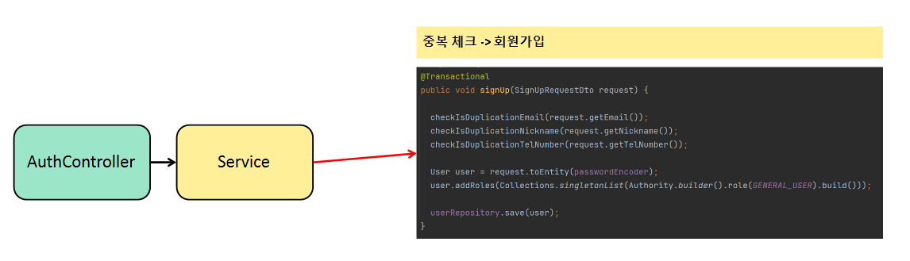
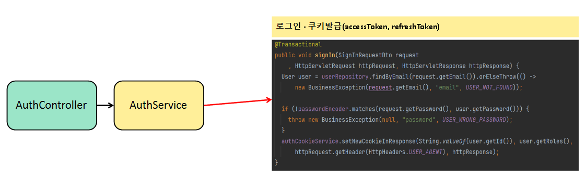
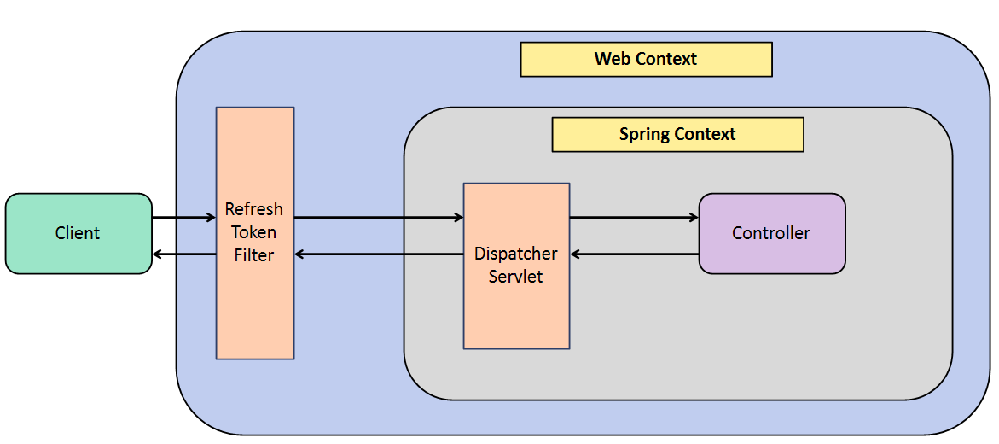
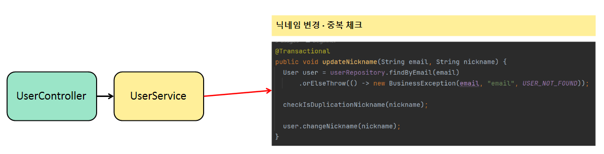
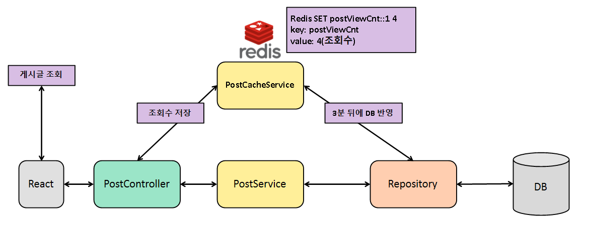

# :pushpin: zoosBlog

> 나만의 블로그 만들기  
> https:// 배포예정

</br>

## 1. 제작 기간 & 참여 인원

- 2023년 10월 15일 ~ 월 일 (진행중)
- 개인 프로젝트

</br>

## 2. 사용 기술

#### `Back-end`

- Java 17
- Spring Boot 3.0.12
- Gradle
- Spring Data JPA
- QueryDSL
- H2
- MySQL
- Spring Security
- Redis

#### `Front-end`

- TypeScript
- React

</br>

## 3. 도메인

```
 ─ domain
    ├─ auth          // 회원가입, 로그인
    ├─ comment       // 댓글
    ├─ favorite      // 좋아요
    ├─ file          // 파일
    ├─ image         // 이미지
    ├─ post          // 게시글
    ├─ searchLog     // 검색기록
    └─ user          // 유저정보
```

## 4. ERD 설계


## 5. 핵심 기능

AccessToken/RefreshToken 방식의 Stateless한 회원 인증/인가 구현이 되어 있습니다.

이 서비스의 핵심 기능은 주간 TOP 3 게시물을 보여주고, 게시물을 작성, 조회하는 기능입니다.

Querydsl의 동적 쿼리를 활용하여, 다중 검색을 지원합니다.

<details>
<summary><b>1. 회원가입</b></summary>
<div markdown="1">



- 중복 체크를 분리한 구조

```java
  private void checkIsDuplicationTelNumber(String telNumber) {
    if (userRepository.existsByTelNumber(telNumber)) {
      throw new BusinessException(telNumber, "telNumber", USER_LOGIN_TEL_NUMBER_DUPLICATE);
    }
  }
```

- 예외처리를 하였습니다.
</div>
</details>
<details>
<summary><b>2. 로그인 / 로그아웃</b></summary>
<div markdown="2">



- 로그인에 성공하면 쿠키를 통해 accessToken과 refreshToken을 발급해줍니다.

```java
public void setNewCookieInResponse(String userId, List<Authority> roles, String userAgent, HttpServletResponse response) {
  String newRefreshToken = jwtProvider.createAccessToken(REFRESH_TOKEN, userId, roles);
  setTokenInCookie(response, newRefreshToken, (int) REFRESH_TOKEN.getExpiredMillis() / 1000,
      REFRESH_TOKEN.getTokenName());
  String newAccessToken = jwtProvider.createAccessToken(ACCESS_TOKEN, userId, roles);
  setTokenInCookie(response, newAccessToken, (int) REFRESH_TOKEN.getExpiredMillis() / 1000,
      ACCESS_TOKEN.getTokenName());
  redisUtil.setDataExpire(JwtProvider.getRefreshTokenKeyForRedis(userId, userAgent), newRefreshToken, REFRESH_TOKEN.getExpiredMillis());
}
```

- 유의한 점은 accessToken(jwt)의 만료시간과, accessToken(cookie)의 만료시간을 다르게 하는 점입니다.
- 쿠키 만료시간을 accessToken(jwt)와 동일하게 맞춘다면, 브라우저에서 accessToken이 만료되어 재발급을 할 수 없게 됩니다.



```java
  @Override
  protected void doFilterInternal(HttpServletRequest request, HttpServletResponse response,
      FilterChain filterChain) throws ServletException, IOException {
    final var accessTokenDto = jwtTokenProvider.tryCheckTokenValid(request, ACCESS_TOKEN);
    final var refreshTokenDto = jwtTokenProvider.tryCheckTokenValid(request, REFRESH_TOKEN);

    List<JwtTokenCondition> jwtTokenConditions = jwtTokenConditionFactory.createJwtTokenConditions();
    jwtTokenConditions.stream()
        .filter(jwtTokenCondition -> jwtTokenCondition.isSatisfiedBy(accessTokenDto, refreshTokenDto, request))
        .findFirst()
        .ifPresentOrElse(jwtTokenCondition -> jwtTokenCondition.setJwtToken(accessTokenDto, refreshTokenDto, request, response),
            () -> authCookieService.setCookieExpired(response));

    filterChain.doFilter(request, response);
  }
```

- accessToken과 refreshToken을 활용하여 사용자의 로그인을 유지시킵니다.
- refreshToken을 재발급할 때, 3가지를 만족해야 합니다. (AccessTokenReissueCondition 코드 일부)

```java
  @Override
  public boolean isSatisfiedBy(TokenValidationResultDto accessTokenDto,
      TokenValidationResultDto refreshTokenDto,
      HttpServletRequest httpRequest) {
    return isTokenExpired(accessTokenDto) &&
        isTokenValid(refreshTokenDto) &&
        isTokenInRedis(refreshTokenDto, httpRequest.getHeader(USER_AGENT));
  }
```

1. accessToken이 만료되었는지
2. refreshToken이 유효한지
3. redis에 저장된 refreshToken과 client에서 보낸 refreshToken이 일치하는지
</div>
</details>
<details>
<summary><b>3. 회원정보 수정(닉네임, 프로필이미지)</b></summary>
<div markdown="3">



</div>
</details>
<details>
<summary><b>4. 게시글 작성 / 수정 / 삭제 / 조회</b></summary>
<div markdown="4">

- 다른 게시글 구현과 비슷하나, 다르게 구현한 점에 대해 설명하고자 합니다.
- 게시글을 조회할 때(상세 보기) 조회수가 증가하는 부분을 Redis를 활용하여 구현하였습니다.

#### 조회수 기능



- 조회수를 반영할 때 Redis에 캐싱하여 서버에 부하를 주는 단순 INSERT 작업을 줄였습니다.
- 3분 뒤에 Redis에 담긴 조회수 증가가 반영이 되며, Redis 캐시는 초기화됩니다.
- 이 방법을 선택한 이유는 서버의 부하도 있었지만, 조회수라는 기능이 바로 반영이 되지 않는다고 사용자에게 큰 불편을 야기할 수 있는 요소가 없었기 때문입니다. 


#### 게시글 페이징 기능

```java
  @Override
  public Page<PostSearchResponseDto> searchPosts(PostSearchCondition condition, Pageable pageable) {
    List<PostSearchResponseDto> content = queryFactory
        .select(constructor(PostSearchResponseDto.class,
            user.profileImage, user.nickname,
            post.createdAt, post.title,
            post.content, post.viewCount,
            post.favoriteCount, post.commentCount,
            ExpressionUtils.as(
                JPAExpressions
                    .select(image.imageUrl)
                    .from(image)
                    .where(image.titleImageYn.isTrue()
                        .and(image.post.id.eq(post.id))
                    ), "boardTitleImage"
            )
        ))
        .from(post)
        .join(post.user, user)
        .leftJoin(post).on(post.id.eq(comment.post.id))
        .where(
            titleLike(condition.getTitle()),
            contentLike(condition.getContent()),
            commentContentLike(condition.getCommentCont()),
            titleAndContentLike(condition.getTitleOrContent()),
            nicknameLike(condition.getNickname())
        )
        .offset(pageable.getOffset())
        .limit(pageable.getPageSize())
        .orderBy(
            post.createdAt.desc()
        )
        .fetch();

    JPAQuery<Long> countQuery = queryFactory
        .select(post.count())
        .from(post)
        .leftJoin(post).on(post.id.eq(comment.post.id))
        .where(
            titleLike(condition.getTitle()),
            contentLike(condition.getContent()),
            commentContentLike(condition.getCommentCont()),
            titleAndContentLike(condition.getTitleOrContent()),
            nicknameLike(condition.getNickname())
        );
    return PageableExecutionUtils.getPage(content, pageable, countQuery::fetchOne);
  }
```

- count 쿼리를 따로 날려주면서 최적화를 진행했습니다. 
- 이미지에 대한 서브 쿼리를 진행할 필요도 없고. 게시글의 개수만 세는 것으로 해서 쿼리를 작성하였습니다.

- PageableExecutionUtils의 getPage를 사용해서 한 페이지에 100개의 게시물을 볼 수 있다고 했을 때, 총 게시물이 80개면 count 쿼리가 수행되지 않아도 위의 페이징을 해주는 쿼리가 수행되면 그 값이 totalCount가 되는 것이기 때문에 쿼리가 2개 나갈걸 1개 나가는 것으로 최적화가 됩니다.
- 한 페이지에 5개씩 게시물을 볼 수 있고, 마지막 페이지인 경우 count쿼리를 안 날려도 5페이지(마지막)이라면 5 * 5 = 25 + 페이징된 게시물 개수 = totalCount가 됩니다.
</div>
</details>
<details>
<summary><b>5. 게시글 다중 검색</b></summary>
<div markdown="5">

#### 게시글 검색 기능


- Querydsl이라는 라이브러리를 통해 자바 코드로 동적 쿼리를 구현하였습니다.

```java
.where(
        titleLike(condition.getTitle()),
        contentLike(condition.getContent()),
        commentContentLike(condition.getCommentCont()),
        titleAndContentLike(condition.getTitleOrContent()),
        nicknameLike(condition.getNickname())
    )

  private BooleanExpression titleLike(String title) {
    return hasText(title) ? post.title.like(likeQuery(title)) : null;
  }

  private BooleanExpression contentLike(String content) {
    return hasText(content) ? post.content.like(likeQuery(content)) : null;
  }
```
</div>
</details>
<details>
<summary><b>6. Top 3 게시물 조회</b></summary>
<div markdown="6">

- Querydsl을 활용하여, 여러 지표를 토대로 Top3 게시물을 조회하는 쿼리를 자바 코드로 구현하였습니다.

```java
  @Override
  public List<PostRankItem> getTop3Posts(LocalDateTime startDate, LocalDateTime endDate) {
    return queryFactory
        .select(
            constructor(PostRankItem.class,
                post.id, post.title,
                post.content, image.imageUrl.as("boardTitleImage"),
                post.favoriteCount, post.commentCount,
                post.viewCount, post.user.nickname.as("writerNickname"),
                post.createdAt.as("writerCreatedAt"),
                post.user.profileImage.as("writerProfileImage")
            )
        )
        .from(post)
        .join(post.user, user)
        .leftJoin(image)
        .on(
            image.post.id.eq(post.id)
                .and(image.titleImageYn.isTrue())
        )
        .where(post.createdAt.between(startDate, endDate))
        .limit(3)
        .orderBy(
            post.favoriteCount.desc(),
            post.commentCount.desc(),
            post.viewCount.desc(),
            post.createdAt.desc()
        )
        .fetch();
  }
```

</div>
</details>

## 6. 프로젝트를 진행하며 고민한 Technical Issue

- 유저의 편의성을 위한 refreshToken 도입
- stateless한 로그인 기능을 구현
- yml설정 파일을 test / dev / product 환경으로 분리
- Redis를 이용하여 서버의 부담을 줄이는 방향으로 조회수 기능 구현
- Test 코드를 작성하므로써 부담이 적은 리팩토링 추구
- 프론트와의 협업을 위한 Rest Docs를 통한 API문서 제공 및 테스트 코드 강제

## 7. 트러블 슈팅

<details>
<summary>회원가입 테스트 코드 작성 시 발생한 문제점</summary>
<div markdown="1">

- presentation Layer를 테스트할 때 [WebMvcTest] 로 필요한 빈들만 주입하여 테스트 하던 도중 403, 401 예외 발생
- 403 인가 - csrf() 설정 추가로 해결
- 401 인증 - Spring Security 설정은 WebMvcTest가 주입해주지 않음
- 블로그 정리 : https://url.kr/gbw8vl
</div>
</details>
<details>
<summary>시큐리티 인증 객체 NullPointException</summary>
<div markdown="2">

- 게시글 등록 기능을 테스트하려고 할 때 [WebMvcTest]로 필요한 빈들만 주입 받고 테스트 코드 작성 중

```java
@PostMapping("")
public ResponseEntity<Void> createBoard(
    @RequestBody @Valid PostCreateRequestDto requestDto,
    @AuthenticationPrincipal CustomUserDetails userDetails
) {
  boardService.create(requestDto, userDetails.getUsername());
  return ResponseEntity.ok().build();
}
```

- AuthenticationPrincipal CustomUserDetails userDetails이 NULL값 발생
- 커스텀 어노테이션을 만들어 해결
- 블로그 정리 : https://zrr.kr/UOTP
- PR : https://github.com/beginner0107/spring-react-blog/pull/64

</div>
</details>
<details>
<summary>추천 기능이 반대로 작동</summary>
<div markdown="3">

- 게시글 추천 기능에 대해 테스트 코드를 작성하는 도중에 추천기능이 제대로 작동하지 않는 것을 확인
- 코드에 대한 실수를 발견해 수정
- PR : https://github.com/beginner0107/spring-react-blog/pull/66

</div>
</details>
<details>
<summary>rest docs 작성 중 Path Variable에 대해 IllegalArgumentException</summary>
<div markdown="4">

- MockMvcRequestBuilders -> RestDocumentationRequestBuilders 변경
- 블로그 정리 : https://zrr.kr/UsrG
</div>
</details>
<details>
<summary>댓글을 삭제할 때 무결성 위배 JdbcSQLIntegrityConstraintViolationException</summary>
<div markdown="5">

- Cascade 옵션 제거
- 블로그 정리 : https://zrr.kr/Bt5V
</div>
</details>
<details>
<summary>@MappedSuperclass 전략을 사용했을 때, LocalDateTime 직렬화, 역직렬화 오류</summary>
<div markdown="6">

- JavaTimeModule은 Java8에 도입된 새로운 날짜, 시간 API를 Jackson 라이브러리에서 적절하게 처리할 수 있게 해주는 모듈
- 기본적인 Jackson 라이브러리는 Java 8의 날짜, 시간 타입을 인식하지 못하기 때문에 발생
- Jackson 라이브러리를 추가적으로 받아 해결하는 방식을 채택
- 블로그 정리 : https://zrr.kr/sxJi
</div>
</details>
<details>
<summary>Querydsl - No constructor found for class. with parameters 에러 발생</summary>
<div markdown="7">

- querydsl으로 DTO 생성자 방식 프로젝션을 사용할 때 이런 문제점 발생

```java
Integer count; // 타입이 일치하지 않음 No constructor found for class
Long count; // 타입 일치
```

- querydsl에서 객체에 .count() 하면 Long 타입으로 반환되는 것을 알게 되어 이를 적용
- PR : https://github.com/beginner0107/spring-react-blog/pull/96
</div>
</details>
<details>
<summary>BDDMockito.given return NULL</summary>
<div markdown="8">
- given 절에 특정 객체를 지정했을 때, 작성한 요청객체와 Mocking된 객체가 다르기 때문에 생긴 문제
- any(요청객체.class) 방식으로 해결

```java
given(searchLogService.getPopularSearchWords(any(SearchType.class))) // <- 구체적인 인스턴스 생성해서 설정해주지 않기
        .willReturn(response);
```

- PR : https://github.com/beginner0107/spring-react-blog/pull/96
</div>
</details>
<details>
<summary>Filter의 중복 작동으로 인한 accessToken, refreshToken 만료 문제</summary>
<div markdown="9">

- accessToken이 만료되었을 때, refreshToken이 있으면 재발급을 해줄 수 있어야 함
- 문제점은 accessToken이 만료되었을 때 재발급되는게 아니라, 아예 cookie를 초기화 시키는 문제 발생
- 해결책으로는 GenericFilterBean을 OncePerRequestFilter로 변경하여 요청 당 한번만 실행되는 것을 보장

- PR : https://github.com/beginner0107/spring-react-blog/pull/111
</div>
</details>
<details>
<summary>게시물 좋아요 리스트 불러오기 N + 1 문제</summary>
<div markdown="10">

- 좋아요 목록을 보여줄 때 유저의 닉네임과 프로필 이미지를 가져와야 하는 부분에서 문제 발생
- LAZY 로딩 전략을 선택했을 때, USER 테이블과 조인해서 가져오지 않으므로 N + 1문제 발생
- 게시글에 추천한 유저가 100명이라면 1 + 100 의 쿼리 발생
- DTO Projection으로 해결
```java
  @Query("SELECT new com.zoo.boardback.domain.favorite.dto.query.FavoriteQueryDto(u.email, u.nickname, u.profileImage) " +
      "FROM FAVORITE F " +
      "JOIN F.FAVORITEFK.USER U " +
      "WHERE F.FAVORITEPK.BOARD= :board")
  List<FavoriteQueryDto> findRecommendersByBoard(@Param("board") Board board);
```

- PR : https://github.com/beginner0107/spring-react-blog/pull/61
</div>
</details>
</br>
