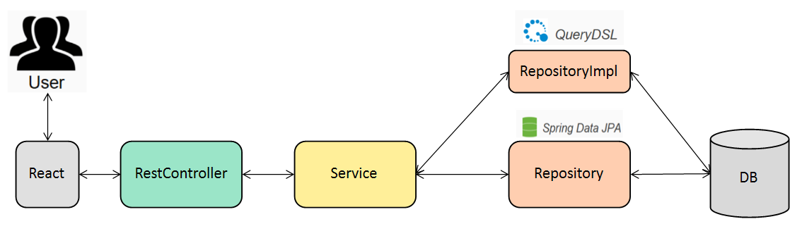

# :pushpin: zoosBlog

> 나만의 블로그 만들기  
> https:// 배포예정

</br>

## 1. 제작 기간 & 참여 인원

- 2023년 10월 15일 ~ 월 일 (진행중)
- 개인 프로젝트

</br>

## 2. 사용 기술

#### `Back-end`

- Java 17
- Spring Boot 3.0.12
- Gradle
- Spring Data JPA
- QueryDSL
- H2
- MySQL
- Spring Security

#### `Front-end`

- TypeScript
- React

</br>

## 3. ERD 설계


## 4. 핵심 기능

Jwt Token방식의 Stateless한 회원 인증/인가 구현이 되어 있습니다.

이 서비스의 핵심 기능은 주간 TOP 3 게시물을 보여주고, 게시물을 작성, 조회하는 기능입니다.

Querydsl의 동적 쿼리를 활용하여, 다중 검색을 지원합니다.

<details>
<summary><b>핵심 기능 설명 펼치기</b></summary>
<div markdown="1">

### 4.1. 전체 흐름



</details>

## 6. 그 외 트러블 슈팅

<details>
<summary>회원가입 테스트 코드 작성 시 발생한 문제점</summary>
<div markdown="1">

- presentation Layer를 테스트할 때 [WebMvcTest] 로 필요한 빈들만 주입하여 테스트 하던 도중 403, 401 예외 발생
- 403 인가 - csrf() 설정 추가로 해결
- 401 인증 - Spring Security 설정은 WebMvcTest가 주입해주지 않음
- 블로그 정리 : https://url.kr/gbw8vl
</div>
</details>
<details>
<summary>시큐리티 인증 객체 NullPointException</summary>
<div markdown="2">

- 게시글 등록 기능을 테스트하려고 할 때 [WebMvcTest]로 필요한 빈들만 주입 받고 테스트 코드 작성 중

```java
@PostMapping("")
public ResponseEntity<Void> createBoard(
    @RequestBody @Valid PostCreateRequestDto requestDto,
    @AuthenticationPrincipal CustomUserDetails userDetails
) {
  boardService.create(requestDto, userDetails.getUsername());
  return ResponseEntity.ok().build();
}
```

- AuthenticationPrincipal CustomUserDetails userDetails이 NULL값 발생
- 커스텀 어노테이션을 만들어 해결
- 블로그 정리 : https://zrr.kr/UOTP
- PR : https://github.com/beginner0107/spring-react-blog/pull/64

</div>
</details>
<details>
<summary>추천 기능이 반대로 작동</summary>
<div markdown="3">

- 게시글 추천 기능에 대해 테스트 코드를 작성하는 도중에 추천기능이 제대로 작동하지 않는 것을 확인
- 코드에 대한 실수를 발견해 수정
- PR : https://github.com/beginner0107/spring-react-blog/pull/66

</div>
</details>
<details>
<summary>rest docs 작성 중 Path Variable에 대해 IllegalArgumentException</summary>
<div markdown="4">

- MockMvcRequestBuilders -> RestDocumentationRequestBuilders 변경
- 블로그 정리 : https://zrr.kr/UsrG
</div>
</details>
<details>
<summary>댓글을 삭제할 때 무결성 위배 JdbcSQLIntegrityConstraintViolationException</summary>
<div markdown="5">

- Cascade 옵션 제거
- 블로그 정리 : https://zrr.kr/Bt5V
</div>
</details>
<details>
<summary>@MappedSuperclass 전략을 사용했을 때, LocalDateTime 직렬화, 역직렬화 오류</summary>
<div markdown="6">

- JavaTimeModule은 Java8에 도입된 새로운 날짜, 시간 API를 Jackson 라이브러리에서 적절하게 처리할 수 있게 해주는 모듈
- 기본적인 Jackson 라이브러리는 Java 8의 날짜, 시간 타입을 인식하지 못하기 때문에 발생
- Jackson 라이브러리를 추가적으로 받아 해결하는 방식을 채택
- 블로그 정리 : https://zrr.kr/sxJi
</div>
</details>
<details>
<summary>Querydsl - No constructor found for class. with parameters 에러 발생</summary>
<div markdown="7">

- querydsl으로 DTO 생성자 방식 프로젝션을 사용할 때 이런 문제점 발생

```java
Integer count; // 타입이 일치하지 않음 No constructor found for class
Long count; // 타입 일치
```

- querydsl에서 객체에 .count() 하면 Long 타입으로 반환되는 것을 알게 되어 이를 적용
- PR : https://github.com/beginner0107/spring-react-blog/pull/96
</div>
</details>
<details>
<summary>BDDMockito.given return NULL</summary>
<div markdown="8">
- given 절에 특정 객체를 지정했을 때, 작성한 요청객체와 Mocking된 객체가 다르기 때문에 생긴 문제
- any(요청객체.class) 방식으로 해결

```java
given(searchLogService.getPopularSearchWords(any(SearchType.class))) // <- 구체적인 인스턴스 생성해서 설정해주지 않기
        .willReturn(response);
```

- PR : https://github.com/beginner0107/spring-react-blog/pull/96
</div>
</details>
</br>

## 6. 회고 / 느낀점

> 프로젝트 개발 회고 글:
